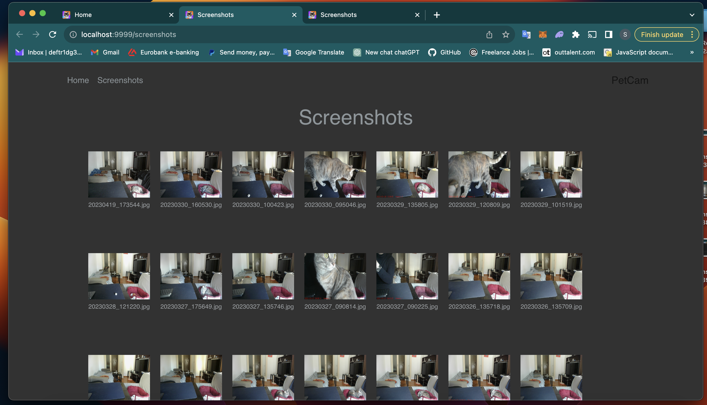
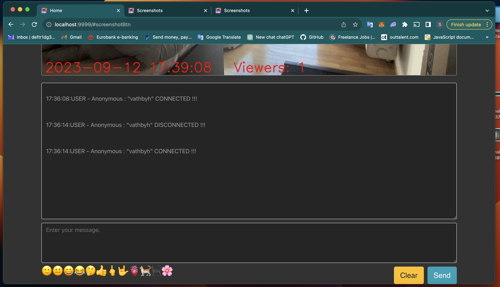

# PetCam

The app created to check how your pet is doing home alone once you are at work.
The app uses webcam of the device that you have at home and 
broadcasting real time stream to the WAN using "ngrok" tunneling.

Becasue the app uses "ngrok" tunneling there is a lags of 2 - 4 sec because fo frame lost.

1. Main window

2. On the stream window there is a button that allowes to take a screeshot.
All screenshots are stored on the './screenshot' forlder in the app source directory.

3. You can select a screenshot and it will be opened in gallery mode.

4. Under the stream window there is a chat.
In case you want to share link with somebody else and to discuss your pet behaviour.
The set of emoji is optimal and does not need to be extended:)))

